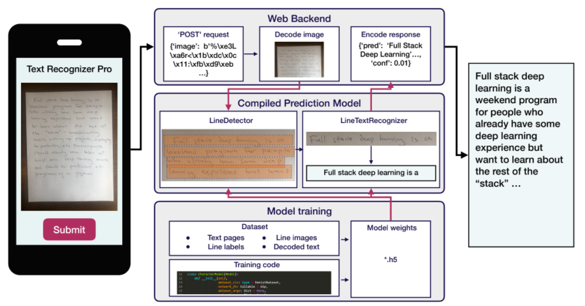

# Goal 
Complete DL project for understanding handwritten text

# Tools & Frameworks:
+ PyTorch + PyTorch Lightning for development 
+ CNNs, RNNs and Transformers as the methods
+ W&B for tracking experiments
+ Docker + AWS Lambda for deployment
