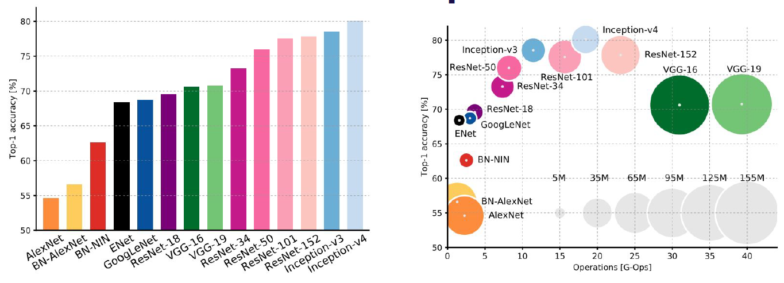

- [2️⃣🅰️ Convolutional Networks (CNNs)](#2------convolutional-networks--cnns-)
  * [Convolutional Filters](#convolutional-filters)
  * [Strides and Padding](#strides-and-padding)
  * [Filter Math](#filter-math)
  * [Receptive Field](#receptive-field)
  * [Dilated Convolutions](#dilated-convolutions)
  * [Other ConvNet Operations](#other-convnet-operations)
  * [ConvNet Architectures](#convnet-architectures)
- [2️⃣🅱️ Computer Vision Applications](#2------computer-vision-applications)
  * [Modern ConvNet architectures](#modern-convnet-architectures)
    + [AlexNet](#alexnet)
    + [VGG](#vgg)
    + [GoogleNet aka Inception](#googlenet-aka-inception)
    + [ResNet](#resnet)
    + [DenseNet](#densenet)
    + [ResNeXt](#resnext)
    + [Squeeze and Excitation Net (SENet)](#squeeze-and-excitation-net--senet-)
    + [SqueezeNet](#squeezenet)
    + [Overall comparison](#overall-comparison)
  * [Classification](#classification)
  * [Localization](#localization)
  * [Detection](#detection)
    + [*Intensive Search* Methods](#intensive-search-methods)
    + [Region Proposal Methods](#region-proposal-methods)
  * [Segmentation](#segmentation)
  * [3D Shape Inference](#3d-shape-inference)
  * [Face Landmark Recognition](#face-landmark-recognition)
  * [Pose Estimation](#pose-estimation)
  * [Style Transfer](#style-transfer)
  * [Adversarial Attacks](#adversarial-attacks)

# 2️⃣🅰️ Convolutional Networks (CNNs)
📼 [Video](https://www.youtube.com/watch?v=hO3kOdShwsI&ab_channel=FullStackDeepLearning) | 📖 [Slides](https://github.com/filipafcastro/fullstack_deeplearning_course/blob/main/Lectures/2%20-%20Convolutional%20Networks/2A%20-%20Convolutional%20Networks.pdf)

## Convolutional Filters
+ Instead of taking the entire image flattened into a vector and then multiplied by a matrix, you extract a single patch of the image (eg. 5x5), which corresponds to a smaller vector, multiply it by a smaller vector as well, and obtain a one dimensional output/value. And you can slide this patch/window, always using the same weights. The outcome is a group of single values (one per each 5x5 patch), which together make a new matrix.

+ Convolutional operations are the basis of image filters, such as blur, when filters are carefully chosen. [See here](https://setosa.io/ev/image-kernels/).

+ But the idea in deep learning is to **learn these filters/weights**, instead of using pre-determined ones.

+ Because images have 3 channels, our filters will need to be not 5x5, but instead 5x5x3. So, instead of having 25 weights, we'll have 75.

+ And instead of having just one learnable convolutional filter, you can have several ones, which learn independently from each other. If you have one, the 3rd dimension/depth of your output will be one. But if you try to apply/learn several convolutional filters for the same image, the number of outputs, this is, the depth of your output will correspond to the number of filters.

+ Then, we can apply another convolutional filter to this output, this is, stack convolutional filters to build a convolutional neural network.

## Strides and Padding

These define how the convolutional filter slides over the image.

+ **Stride**: convolutions which subsample the image by jumping across some locations. If stride=1, there are no jumps and no subsampling.

+ **Padding**: add default values to the border of the images (extra rows/cols), so that you can still apply the convolution/operations near the borders. It solves the problem of filters running out of the image. Usually default=0.

## Filter Math

Every time you apply a filter you need to know what will be the size of the output, as this will be the input for the next layer and you need to design the next filter of the network.

+ **input**: W x H x D volume

+ **parameters**: 

    + K filters, each with size (F,F), normally set to powers of 2 (eg. 32, 64, etc)
    + stride (S,S), commonly (5,5), (3,3), (2,2), (1,1)
    + padding P

+ **output**: W'x H' x K volume

    + W' = (W-F+2P) / S + 1

    + H' = (H-F+2P) / S + 1

Check visualizations [here](https://github.com/vdumoulin/conv_arithmetic)

## Receptive Field
+ For a particular pixel/position in the output, which pixels/positions in the original input contributed to that outputs' value? Eg. if we have a 3x3 filter with stride 1, we say that the receptive field is 3x3. Each pixel in the output sees a 3x3 patch of pixels in the input.

+ If we stack convolutional operations, we'll increase the receptive field. Eg. input 5x5, apply 2 convolutions of 3x3. The output has a receptive field of 5x5.

+ Stacking two 3x3 convolutions has the same RF as one 5x5, but it has fewer parameters and normally works better.

## Dilated Convolutions
+ Another alternative to increase the receptive field is to use **dilated convolutions**. They see a greater portion of the image by skipping pixels in their convolutions. A 3x3 dilated convolution has 9 weights and a receptive field of 5x5.

+ We can also stack dilated convolutions.

## Other ConvNet Operations

+ To decrease the size of the input, one can use **poling** by subsampling the input through average or max of each region. More info [here](https://cs231n.github.io/convolutional-networks/#pool)

+ To decrease the nr of channels/depth of a tensor, we can apply **1x1 convolutions**. It corresponds to applying a MLP to every pixels in the convolutional output. The receptive field of each convolution is a single pixel but you're seeing the entire depth.. This operation is very popular on ConvNet architectures (eg. Inception).

## ConvNet Architectures

**LeNet(-like)**: [(Conv filter + Non-linearity) x many times --> pooling] x many times --> (FC + non-linearity) x many times --> Softmax. [Check slide 64](https://github.com/filipafcastro/fullstack_deeplearning_course/blob/main/Lectures/2%20-%20Convolutional%20Networks/2%20-%20Convolutional%20Networks.pdf)

# 2️⃣🅱️ Computer Vision Applications
📼 [Video](https://www.youtube.com/watch?v=rHGUVo6GjVA&ab_channel=FullStackDeepLearning) | 📖 [Slides](https://github.com/filipafcastro/fullstack_deeplearning_course/blob/main/Lectures/2%20-%20Convolutional%20Networks/2A%20-%20Convolutional%20Networks.pdf) | 💻 [CV algorithms](https://paperswithcode.com/area/computer-vision)

## Modern ConvNet architectures
You can check [torchvision models](https://pytorch.org/vision/0.) to check for the most popular ConvNets. 

### AlexNet
+ It started the ConvNet revolution with outstanding performance on ImageNet on 2012. They introduced the **ReLU**, **dropout** and **heavy data augmentation**.

### VGG 
+ It was also very successful by introducing a deeper architecture (more layers) and an increasing nr of channels at each layer.

### GoogleNet aka Inception 
+ It is as deep as VGG, but with only 3% of the parameters. 

+ No FC layers. 

+ It consists of stacking Inception modules. An inception module passes the input through different conv operations in parallel: 1x1, 3x3 and 5x5 (same as two stacked 3x3), to then concatenate the results deepwise. The first conv is always 1x1, to reduce the number of channels to 1. They assume that cross-channel correlations (depth dimension) and spatial correlations (spatial dimensions) are decoupled and can be mapped separately. [See slide 23](https://github.com/filipafcastro/fullstack_deeplearning_course/blob/main/Lectures/2%20-%20Convolutional%20Networks/2A%20-%20Convolutional%20Networks.pdf).

+ They also hake classification outputs at the middle of the network (like in branches) and they use it to inject classifier loss gradients in the middle of the network, instead of having a single gradient coming from the output.

### ResNet
+ Most common ConvNet used now

+ They introduced skip connections to fight the problem of vanishing gradients. You had the input to the output of each layer (identity path) so that you've an alternative for the gradient not to vanish on that layer. It's basically a shortcut from the input around the processing of the input. It's a residual network because basically you're trying to learn the residual.

+ They stopped using the max pool operation. Instead, they downsample spatially using strides.

### DenseNet
+ It's a ResNet variant with more skip connections

### ResNeXt
+ It kind of combines Inception + ResNet ideas.

### Squeeze and Excitation Net (SENet)
+ Adds a module of global pooling (averages everything) + FC to allow for reweighting each feature map. It's similar to attention, the network makes every channel having the same importance (avg pooling) and then learns (w/ the FC layer) which feature maps are more important and scales its importance.

### SqueezeNet
+ Same performance as AlexNet with 50x fewer parameters.

+ They add 1x1 convolutions, called bottlenecks, to reduce the nr of channels. The nr of channels never expands.

### Overall comparison

At [Stanford DAWNBench](https://dawn.cs.stanford.edu/benchmark/) you can compare the performance of different networks on ImageNet in terms of training time, training cost, latency, inference cost, etc.

## Classification

The output is the single object's class

## Localization

The output is the single object's class and its location within the image

+ We can use exactly the same network we would use to classify the image, but add outputs to the networks' head, this is, the bounding box coordinates (x1, y1, x2, y2). We know/assume there's only one object in the image.

## Detection

The output is every object's class and location

### *Intensive Search* Methods

+ Here we don't know how many objects are there. One solution would be to slide the previous classifier network over the image at multiple patch scales, but it's very computationally expensive.

+ The **overfeat** method tried to solve this by replacing the FC layers of the classification network by 1x1 conv layers. For each location considered, they predict the class and the BB.

+ **YOLO** (You Only Look Once) and **SSD** (Single Shot Detector) follow a similar logic. They *apply* a grid to the image and, for each grid of the cell, predict the presence of an object centerpoint, with several *anchor boxes* of different aspect ratios. They predict a class and a BB for each anchor box + cell and they apply NMS afterward.

+ [Microsoft COCO](https://cocodataset.org/) is the most popular dataset for training object detection methods.

+ **Non-maximum Supression (NMS)** means that when BBs overlap significantly, only the one with the highest score should remain.

+ **Intersection over Union (IoU)** is the most common metric for localization quality. It computes the IoU between our detection and the GT detection.

### Region Proposal Methods
An alternative to looking for an object in every place in an image. It only looks at the regions that seem interesting. 

+ **R-CNN** was the 1st one (traditional/external method to find region proposals + AlexNet on squared proposals + BB and class prediction on the top of AlexNet). 

+ **Faster R-CNN** firstly applies a CNN to the image and then applies a region proposal network (RPN) to the resulting feature map. Because it's all about convnets, and we don't have external methods here, the approach is faster. The **RPN** is a fully convolutional method that scores a bunch of candidate windows for *objectness*. These windows slide over the feature map, similarly to what happens in methods such as YOLO and SSD.

## Segmentation
It consists in labeling every pixel in the image as belonging to an object or to the background. **Instance segmentation** additionally differentiates between different objects of the same image. Instead of 'these pixels belong to a dog', you need to tell 'these pixels belong to dog nr 1'. 

+ **Mask-RCNN** is an extension of Faster R-CNN where ROIs are not only classified and BB-regressed, but also go through an **instance segmentation module**.

+ **Fully Convolutional Nets** (eg. UNet) look at the entire image for segmentation, instead of only looking at region proposals. They are based on encode-decode operation, this is, shrink down --> upsample. There are 3 options for **upsampling**:

    + Unpooling: remember which pixels were max-pooled and use the same when upstampling

    + Transpose convolutions: learnable upsampling

    + Dilated convolutions

## 3D Shape Inference

Besides predicting the class, the BB and the segmentation masks, we can also predict the 3D mesh of a 2D image. But here's the need for labeled data (eg. [ShapeNet](www.shapenet.org)).

## Face Landmark Recognition

Given an image, predicts landmarks, for instance, face keypoints (eyes, eyebrows, mouth), trained with datasets such as [Annotated Faces in the Wild](https://www.tugraz.at/institute/icg/research/team-bischof/lrs/downloads/aflw/).

## Pose Estimation
Predict body landmarks, such as joint locations, trained on datasets such as [Microsoft COCO](https://cocodataset.org/).

## Style Transfer
Based on Generative Adversarial Networks (GANs). [Here's](https://ndres.me/post/machine-learning-with-gifs-style-transfer/) a nice GIF which explain the logic behind it.

## Adversarial Attacks

Sometimes ConvNets are surprisingly brittle. They can, for instance, change their prediction radically by just adding a bit of imperceptible noise (see [panda's example on slide 76](https://github.com/filipafcastro/fullstack_deeplearning_course/blob/main/Lectures/2%20-%20Convolutional%20Networks/2A%20-%20Convolutional%20Networks.pdf))

This is dangerous because you can even add real/physical elements that in some way perturb the ConvNet and make it work wrong (eg. wrongly detect a STOP sign in an autonomous car by placing some stitches in the sign). More examples on [this](https://arxiv.org/abs/1707.08945) paper.

+ **White-box attacks:** can you generate an adversarial attack when you have access to the model parameters?

+ **Black-box attacks:** can you generate an adversarial attack when you don't even have access to the model parameters?